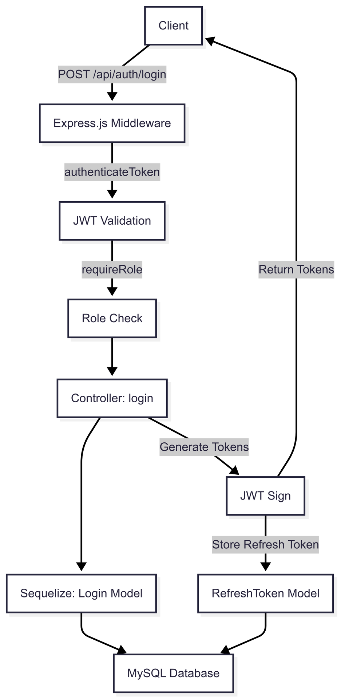

# 📦 SmartMart Backend Documentation

> **A secure, modular, and scalable e-commerce API built with Node.js, Express.js, and Sequelize.**  
> Focused on JWT authentication, refresh token management, and production-ready deployment.


---

## ✨ Key Features

- JWT authentication with refresh token rotation
- Role-based authorization (user, staff, admin)
- ePayco payment gateway integration
- Slug-based product and category URLs
- Modular Express.js routing and middleware
- RESTful APIs with Sequelize ORM
- Soft delete pattern

---

## 📋 Table of Contents

- [Purpose and Scope](#purpose-and-scope)
- [Technology Stack](#technology-stack)
- [Key System Components](#key-system-components)
- [Authentication Architecture](#authentication-architecture)
- [JWT Authentication System](#jwt-authentication-system)
- [User Registration & Login Flow](#user-registration--login-flow)
- [Permission System](#permission-system)
- [Security Highlights](#security-highlights)
- [API Endpoints](#api-endpoints)
- [Business Logic Overview](#business-logic-overview)
- [File Structure & Models](#file-structure--models)
- [Product & Category Models](#product--category-models)
- [Order Models](#order-models)
- [Data Serialization](#data-serialization)
- [Model Relationships & Rules](#model-relationships--rules)
- [Database Table Mappings](#database-table-mappings)
- [Environment Setup](#environment-setup)
- [API Testing](#api-testing)

---

## Purpose and Scope 

The **SmartMart backend** is a Node.js/Express.js-based e-commerce API that handles:

- 🛍 Product catalog CRUD operations and inventory management
- 👥 User registration, email verification, login/logout
- 🛒 Order management with ePayco payment integration
- 🔐 JWT-based authentication with refresh token management
- ⚙ Modular architecture with Express.js routing and Sequelize ORM
- 🔗 RESTful APIs with middleware-driven security

---

## Technology Stack

| Layer          | Technology            | Version | Purpose                              |
|----------------|----------------------|--------|-------------------------------------|
| Web Framework  | Express.js            | 4.18.x | Core application and routing       |
|                | Node.js               | 18.x   | Runtime environment                |
| Authentication | jsonwebtoken          | 9.x    | JWT authentication and signing     |
| Data Layer     | Sequelize ORM         | 6.x    | Database abstraction               |
|                | MySQL2                | 3.x    | MySQL driver                       |
| Database       | MySQL                 | 8.x    | Production database                |
| Caching        | NodeCache             | 5.x    | Temporary checkout and token storage |

Note:

This table shows the principal technologies.

To run the system, you must install all required Python packages listed in `requirements.txt`.

---

## Key System Components

### Authentication & Security

- JWT-based authentication with access (15-min expiry) and refresh tokens (7-day expiry)
- Role-based access control (user, staff, admin)
- Refresh token storage and revocation
- Middleware for token validation and role enforcement
- Email verification for user registration




---

### Product Catalog System

- CRUD operations for products and categories
- Slug-based hierarchical organization
- Inventory tracking with stock quantity
- External image URLs (e.g., Unsplash)
- Soft delete pattern for data preservation


---

### Order Management

- ePayco checkout and payment confirmation via webhooks
- NodeCache for temporary order storage (5-min TTL)
- Invoice generation with UUID
- Tracks subtotal, tax (19%), and payment status
- Atomic transactions for order creation and inventory updates


---

## Authentication Architecture

- JWT-based with access and refresh tokens
- Refresh token persistence in database
- Role-based authorization (user, staff, admin)
- Secure logout with token revocation
- Middleware-driven token and role validation

---

## JWT Authentication System

> Custom JWT implementation with refresh token management.

- Validates tokens using `jsonwebtoken` library
- Stores refresh tokens in `RefreshToken` model
- Revokes tokens on logout
- Auto-cleans expired tokens via database event

<details>
<summary>📂 RefreshToken Model</summary>

| Field           | Type      | Purpose                |
|----------------|-----------|-----------------------|
| userId         | BIGINT    | Links to user account |
| token          | TEXT      | Full JWT refresh token |
| jti            | STRING(64)| Unique JWT identifier |
| revoked        | BOOLEAN   | Revocation status     |
| issuedAt       | DATE      | Token creation time   |
| expiresAt      | DATE      | Token expiry time     |

Includes daily event: `revoke_refresh_tokens`
</details>

---

## User Registration & Login Flow

### Registration

- `requestRegistration`: Validates input, caches data, sends email
- `createUserAfterVerification`: Verifies token, creates user


---

### Login Process

| Step | Component                | Purpose                          |
|-----|-------------------------|---------------------------------|
| 1   | loginInputSchema       | Validate credentials           |
| 2   | Login.findOne()        | Check email existence          |
| 3   | bcrypt.compare()       | Verify password                |
| 4   | User.findOne()         | Ensure active account          |
| 5   | jwt.sign()             | Generate access/refresh tokens |
| 6   | RefreshToken.create()  | Store refresh token            |
| 7   | Response               | Return tokens                  |

---

### Logout Process

- Marks refresh token as `revoked: true` in database
- Allows access token to expire naturally


---

## Permission System

| Role          | Purpose                                |
|---------------|----------------------------------------|
| User          | Read-only on products/orders           |
| Staff         | CRUD on products/categories            |
| Admin         | Full access incl. user management      |

- Middleware: `authenticateToken`, `requireRole`
- Database-driven role validation via `Roles` model

---

## Security Highlights

- Refresh token rotation and revocation
- Daily cleanup of expired tokens
- Email verification TTL: 5 minutes
- JWT signature validation with secrets
- Unique JTI for token tracking
- Password hashing with bcrypt
- ePayco webhook signature validation via SHA256

---

## API Endpoints

### Product Management

| Endpoint                | Method | Auth | Purpose          |
|------------------------|------|----|-----------------|
| `/api/products/createproduct/` | POST | JWT | Create product  |
| `/api/products/listproducts/` | GET  | —   | List products   |
| `/api/products/retrieveproduct/{slug}/` | GET  | —   | Retrieve product |


---

### Category Management Endpoints

| Endpoint                            | Method | Auth | Permissions                           | Purpose                     |
|-------------------------------------|--------|------|---------------------------------------|-----------------------------|
| `/api/categories/listcategories/`   | GET    | —    | —                                     | List active categories      |
| `/api/categories/createcategory/`   | POST   | JWT  | requireRole('staff')                 | Create category             |
| `/api/categories/retrievecategory/{slug}/` | GET | —    | —                                     | Retrieve category           |
| `/api/categories/updatecategory/{slug}/{id}/` | PUT | JWT | requireRole('staff')                 | Update category             |
| `/api/categories/deletecategory/{slug}/{id}/` | DELETE | JWT | requireRole('staff')              | Soft delete category        |
| `/api/categories/activatecategory/{slug}/{id}/` | PATCH | JWT | requireRole('staff')             | Activate category           |
| `/api/categories/deactivatecategory/{slug}/{id}/` | PATCH | JWT | requireRole('staff')           | Deactivate category         |


---

### User Management Endpoints

| Endpoint             | Method | Auth | Permissions               | Purpose                   |
|----------------------|--------|------|---------------------------|---------------------------|
| `/api/users/user/`   | GET    | JWT  | requireRole('user')       | View profile              |
| `/api/users/updateuser/` | PATCH | JWT | requireRole('user')      | Update profile            |
| `/api/users/deactivateuser/` | PATCH | JWT | requireRole('user')    | Deactivate account        |
| `/api/users/listusers/` | GET | JWT | requireRole('admin')      | List all users            |
| `/api/users/deleteuser/{id}/` | DELETE | JWT | requireRole('admin')   | Delete user               |
| `/api/users/registeruser/` | POST | — | —                        | Request registration      |
| `/api/users/registerstaffuser/` | POST | — | —                    | Request staff registration |
| `/api/users/verifyemail/` | GET | — | —                      | Verify email              |


---

### Order Management Endpoints

| Endpoint                        | Method | Auth | Permissions                     | Purpose                                  |
|---------------------------------|--------|------|---------------------------------|------------------------------------------|
| `/api/checkout/`                | POST   | JWT  | requireRole('user')             | Generate ePayco payment data             |
| `/api/checkout/confirmation/`   | POST   | —    | AllowAny                        | Process ePayco payment confirmation      |
| `/api/epayco/response/`         | GET    | —    | AllowAny                        | Handle ePayco payment response (redirect) |

#### Details

- **`/api/checkout/`**  
  - Input: JSON with `items` (array of `{product_id, quantity}`)
  - Validates items, calculates subtotal and tax (19%), caches order in NodeCache (5-min TTL), returns ePayco payment data
  - Requires: authenticated user

- **`/api/checkout/confirmation/`**  
  - Input: payment data (`x_ref_payco`, `x_signature`, etc.)
  - Validates SHA256 signature, creates `Order` and `OrderItem` records if `x_cod_transaction_state == "1"`
  - Public endpoint (no auth required)

- **`/api/epayco/response/`**  
  - Handles redirect after payment attempt
  - Serves static HTML with transaction details via AJAX
  - Public endpoint (no auth required)

> Signature validated using `P_CUST_ID_CLIENTE` and `P_KEY`


---

## Business Logic Overview

- **User Flow**: Register → verify email → login
- **Product & Category**: CRUD with slug generation, soft deletes
- **Orders**: Checkout → cache → payment confirmation → inventory update
- **Security**: Token management, signature validation
- **Validation**: Zod schemas for input/output consistency


---

## File Structure & Models

| File/Folder        | Purpose                                    |
|--------------------|---------------------------------------------|
| `models/`          | Sequelize models: User, Product, Category, Order, etc. |
| `controllers/`     | Business logic for API endpoints           |
| `routes/`          | Express.js route definitions               |
| `middleware/`      | Authentication and role validation         |
| `config/db/`       | Database connection and pool settings     |
| `bin/www.js`       | Server initialization and lifecycle        |

---

## Product & Category Models

<details>
<summary>Category</summary>

Fields: `id`, `name`, `slug`, `isActive`, `createdAt`, `updatedAt`  
Unique: `name`, `slug`  
Auto-generates slug using `slugify`.
</details>

<details>
<summary>Product</summary>

Fields: `id`, `name`, `slug`, `description`, `price`, `stock_quantity`, `category_id`, `isActive`, `createdAt`, `updatedAt`  
Unique: `name`, `slug`  
Foreign Key: `category_id` (links to active category).
</details>

---

## Order Models

<details>
<summary>Order</summary>

Fields: `id`, `invoiceId`, `userId`, `subTotal`, `tax`, `total`, `isPaid`, `paymentReference`, `createdAt`, `updatedAt`  
Unique: `invoiceId`  
Foreign Key: `userId`.
</details>

<details>
<summary>OrderItem</summary>

Fields: `id`, `productId`, `orderId`, `quantity`, `price`  
Foreign Keys: `productId`, `orderId`  
Stores price snapshot at order time.
</details>

---

## Data Serialization

- Zod schemas (`categoryInputSchema`, `productInputSchema`, `checkoutSerializer`, etc.) for input validation
- Output serializers (`categoryOutputSerializer`, `productOutputSerializer`) for consistent responses
- Ensures data integrity and standardized API responses


---

## Model Relationships & Rules

- `User` ↔ `Orders` (one-to-many)
- `Category` ↔ `Products` (one-to-many)
- `Product` ↔ `OrderItems`, `ProductImage` (one-to-many)
- Soft deletes via `isActive` flag
- Auto-generated slugs for SEO-friendly URLs
- Unique invoice IDs and names
- Price snapshots in `OrderItem`


---

## Database Table Mappings

| Model                   | Table                   |
|------------------------|------------------------|
| User                   | users                  |
| Category               | category               |
| Product                | product                |
| ProductImage           | productimage           |
| Order                  | order                  |
| OrderItem              | orderitem              |
| Login                  | login                  |
| RefreshToken           | refresh_tokens         |
| Roles                  | roles                  |

---

## Environment Setup

```bash
cd smartmart
npm install
cp .env.example .env
node bin/www.js
```

* Adjust `.env` with:
  - Database credentials (`POOLMAX`, `POOLMIN`, etc.)
  - JWT secrets (`ACCESS_TOKEN_SECRET`, `REFRESH_TOKEN_SECRET`)
  - ePayco keys (`P_CUST_ID_CLIENTE`, `P_KEY`)
  - SMTP settings for email

---

## API Testing

[](https://app.getpostman.com/run-collection/45628109-87bfbf88-c31d-435c-8c56-2c99feda793d?action=collection%2Ffork&source=rip_markdown&collection-url=entityId%3D45628109-87bfbf88-c31d-435c-8c56-2c99feda793d%26entityType%3Dcollection%26workspaceId%3D4fe177eb-d532-4441-9f6d-3828da9840ac)

